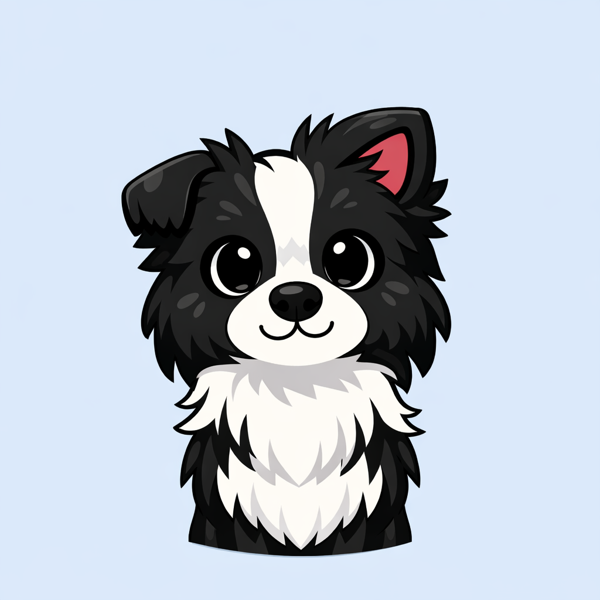

# 👋 Bem-vindo ao Portfólio de Caroline Amancio

### 💻 Game Director | 🎮 Game Developer | 🚀 Game Designer

---

## 📖 Sobre Mim

Olá! Sou **Caroline Amancio**, uma desenvolvedora apaixonada por tecnologia e inovação.

Meu objetivo é criar portais de jogos.
> 💡 *"A tecnologia é melhor quando une criatividade e inovação"*

---

---

## 🎯 Meus Projetos Destaque

### 🎮 Plataforma de jogos
> Um jogo web envolvente desenvolvido com JavaScript puro
- ✨ Gráficos incríveis
- 🎮 Jogabilidade fluida
- 📱 Compatível com múltiplos dispositivos
- ⚡ Performance otimizada

**Tecnologias:** JavaScript, HTML5, CSS3  
[🔗 Ver Projeto](#) | [📦 Código-fonte](#)

---

## 🛠️ Stack Tecnológico

### Frontend

### Ferramentas

---

## 🌱 O Que Estou Aprendendo

- 🤖 Inteligência Artificial
- 🎮 Criação de jogos

---

## 🙏 Agradecimentos

Obrigada por visitar meu portfólio! Se tiver alguma dúvida ou sugestão, não hesite em entrar em contato. 

 

⭐ Se você gostou, considere deixar uma estrela! ⭐

---

**Feito com ❤️ por Caroline Amancio**

© 2026 Todos os direitos reservados.

